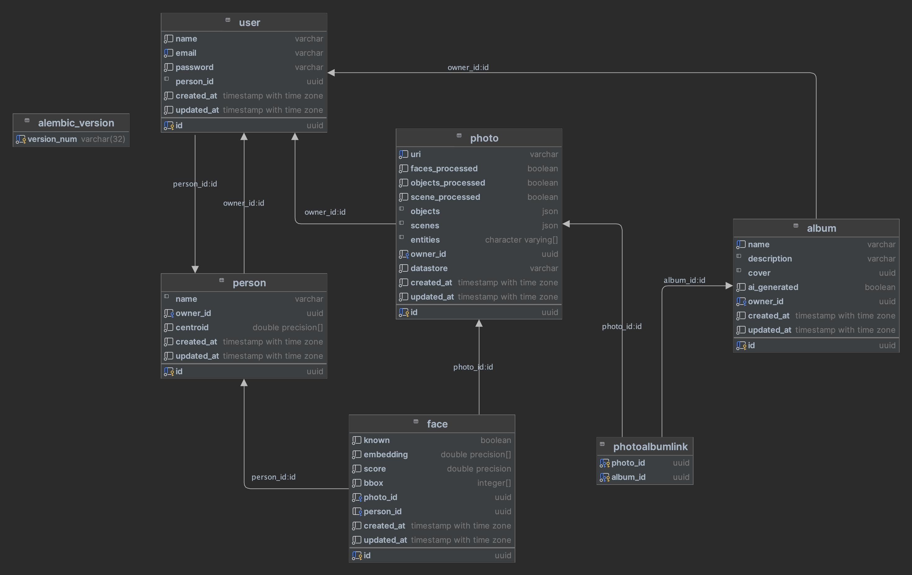

ChatterChum
===========

ChatterChum is an end to end AI-powered photo management tool similar to Google Photos from scratch which is capable of automatically tagging photos based on objects, recognize familiar faces, and also generate an album based on a user requirement.

## Features
- [x] **Entity Detection**: Automatically tag photos based on people, objects, and places.
- [x] **Cluster Photos**: Group photos based on the similarity of objects, people, and places.
- [x] **Search Photos**: Search photos based on tags, people, and places using natural language.
- [x] **Perform Complex Queries**: Search photos based on multiple tags, people, and places.
- [x] **Multiple Databases**: Support for MongoDB and Postgres out of the box.
- [x] **Multiple Storage**: Support for Google Cloud Storage and local storage.


#### Assumptions Made
- Scene detection is based on the location of the photo and not exactly the literal scene in the photo. (Eg: A photo taken at a beach will be tagged as a beach photo, but a birthday party photo taken at a beach will still be tagged as a beach photo.)


## Tech Stack
- **Backend**: FastAPI
- **Database**: Postgres/MongoDB + Qdrant
- **AI Models**: Vision Transformers, Detectron, FaceNet, CLIP, Cohere(LLM), WaveMix
- **Frontend**: ReactJS
- **File Storage**: Google Cloud Storage, Local Storage

## Architecture


## Database Schema



## Setup
1. Clone the repository
```bash
git clone https://github.com/vsaravind01/ChatterChum.git
```
2. Install the dependencies
```bash
pip install -r requirements.txt
```

3. Run the setup script
```bash
python setup.py setup
```

   This will guide you through setting up the database, storage and application configurations interactively.

   Alternatively, you can set up each component separately:
   - Database setup: `python setup.py setup-db --interactive/-i`
   - Storage setup: `python setup.py setup-storage --interactive/-i`
   - Application setup: `python setup.py setup-app --interactive/-i`

4. Review your settings
```bash
python setup.py show-settings
```

5. Environment Variables
```bash
export SECRET_KEY=<secret_key>
export ALGORITHM=<algorithm>
export COHERE_API_KEY=<API_KEY>
```

> **Note**: For setting up the development environment for GCloudStore, follow the necessary steps at [here](https://cloud.google.com/docs/authentication/application-default-credentials).

## Usage
1. Run the application
```bash
python app.py
```
or
```bash
uvicorn app:app --reload --port 8000 --host 0.0.0.0
```

## Running the Inference Pipeline
1. Run the face clustering pipeline
```bash
python ./pipeline/face_cluster_runner.py --user-id <user_id> --init_max_size 3 --threshold 0.72 --min_community_size 2 --num_workers 3
```
2. Run the object detection pipeline
```bash
python ./pipeline/object_detection_runner.py --user-id <user_id> --num_workers 3
```
3. Run the scene detection pipeline
```bash
python ./pipeline/scene_detection_runner.py --user-id <user_id> --num_workers 3
```


## API Documentation
> **Note**: Run the application and use the following endpoint
- **Swagger UI**: http://localhost:8000/docs
