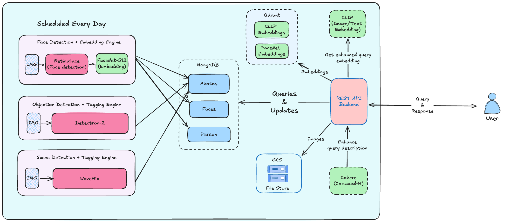

ChatterChum
===========

ChatterChum is an end to end AI-powered photo management tool similar to Google Photos from scratch which is capable of automatically tagging photos based on objects, recognize familiar faces, and also generate an album based on a user requirement.

## Features
- [x] **Entity Detection**: Automatically tag photos based on people, objects, and places.
- [x] **Cluster Photos**: Group photos based on the similarity of objects, people, and places.
- [x] **Search Photos**: Search photos based on tags, people, and places using natural language.
- [x] **Perform Complex Queries**: Search photos based on multiple tags, people, and places.


#### Assumptions Made
- Scene detection is based on the location of the photo and not exactly the literal scene in the photo. (Eg: A photo taken at a beach will be tagged as a beach photo, but a birthday party photo taken at a beach will still be tagged as a beach photo.)


#### Future Scope
- [ ] **Improvised Query Processing**: Implement a more advanced query processing system to handle complex queries.
- [ ] **Auto Trigger Events**: Automatically trigger events based on the user's query, like creating an album, etc. (Partially implemented)
- [ ] **Smooth User Experience**: Implement a more user-friendly interface to interact with the system.

## Tech Stack
- **Backend**: FastAPI
- **Database**: MongoDB + Qdrant
- **AI Models**: Vision Transformers, Detectron, FaceNet, CLIP, Cohere(LLM), WaveMix
- **Frontend**: ReactJS
- **File Storage**: Google Cloud Storage

## Architecture



## Setup
1. Clone the repository
```bash
git clone https://github.com/vsaravind01/ChatterChum.git
```
2. Install the dependencies
```bash
pip install -r requirements.txt
```

## Configuration
1. Create a `.env` file in the root directory and add the following configurations
```bash
export SECRET_KEY=<secret_key>
export ALGORITHM=<algorithm>
export COHERE_API_KEY=<API_KEY>

```

## Usage
1. Run the application
```bash
python app.py
```
or
```bash
uvicorn app:app --reload --port 8000 --host 0.0.0.0
```

## Running the Inference Pipeline
1. Run the face clustering pipeline
```bash
python ./pipeline/face_cluster_runner.py --user-id <user_id> --bucket chatterchum-photo-store --init_max_size 3 --threshold 0.72 --min_community_size 2 --nproc 3 --num_workers 3
```
2. Run the object detection pipeline
```bash
python ./pipeline/object_detection_runner.py --user-id <user_id> --bucket chatterchum-photo-store --nproc 3 --num_workers 3
```
3. Run the scene detection pipeline
```bash
python ./pipeline/scene_detection_runner.py --user-id <user_id> --bucket chatterchum-photo-store --nproc 3 --num_workers 3
```


## API Documentation
- **Swagger UI**: http://localhost:8000/docs
